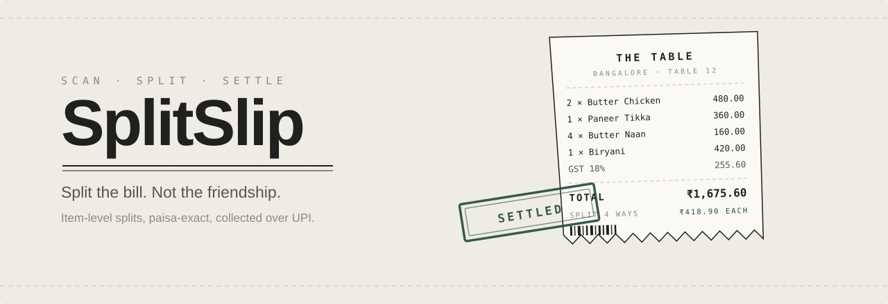
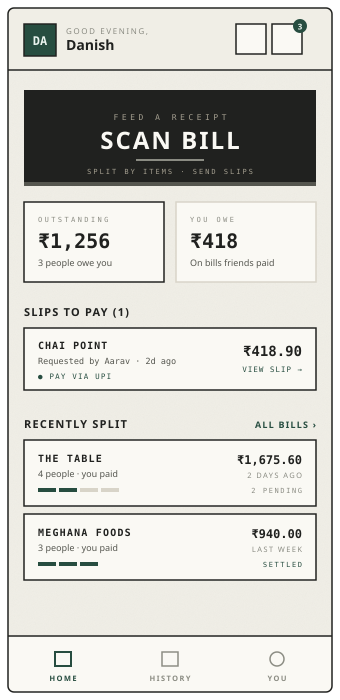
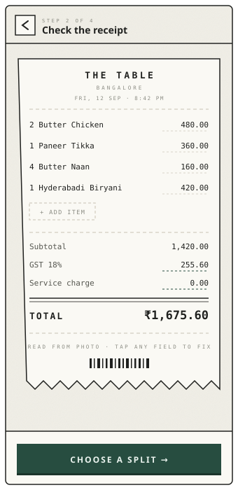
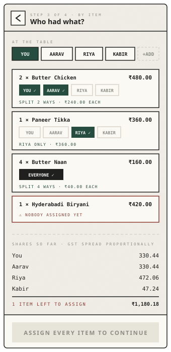
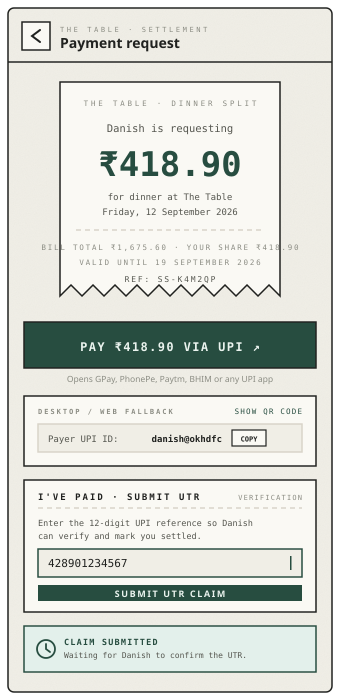

<div align="center">



<br>

**Split the bill. Not the friendship.**

Scan a restaurant receipt, split it by item, and collect exactly what everyone owes —
down to the last paisa.

[](LICENSE)
[](https://react.dev)
[](https://www.typescriptlang.org)
[](https://convex.dev)
[](https://capacitorjs.com)
[](CONTRIBUTING.md)

</div>

---

## The problem

One person taps their card at dinner. Then comes the group chat: a wall of
"who had the biryani", a screenshot of the bill, somebody doing long division
badly, and three people who quietly never pay.

Splitting equally is easy and wrong. The friend who had a soda shouldn't
subsidise your butter chicken. Splitting properly means per-item arithmetic,
proportional tax, and then actually chasing people — which nobody does.

SplitSlip does the arithmetic exactly and turns each share into its own
payment slip.

---

## Screenshots

> The images below are on-brand UI previews rendered from the app's real design
> tokens. See [`docs/screenshots/`](docs/screenshots/) to swap in device captures.

<div align="center">
<table>
<tr>
<td width="25%"></td>
<td width="25%"></td>
<td width="25%"></td>
<td width="25%"></td>
</tr>
<tr align="center">
<td><b>Home</b><br><sub>What you're owed</sub></td>
<td><b>Review</b><br><sub>Fix what OCR missed</sub></td>
<td><b>Split</b><br><sub>Tap who had what</sub></td>
<td><b>Settle</b><br><sub>Pay, then prove it</sub></td>
</tr>
</table>
</div>

---

## How it works

```
  📷 Scan            ✏️ Review           👥 Split            📤 Send            ✅ Settle
  ─────────          ─────────           ─────────           ─────────          ─────────
  Photograph    →    OCR reads the   →   Equal, by item, →   Each person   →    They pay by UPI
  the receipt        restaurant,         or custom           gets their own     and submit a UTR.
                     items, GST.         amounts.            payment slip.      You verify it.
```

**1. Scan** — The camera captures the receipt and [tesseract.js](https://tesseract.projectnaptha.com)
reads it in the browser. No image ever leaves the device for OCR. A heuristic
parser pulls out the restaurant, city, line items, GST and service charge.

**2. Review** — OCR is never perfect, so every field is editable before you
commit. Fix a misread price, add a missed item, correct the tax.

**3. Split** — Three modes:
- **Equal** — the total divided evenly, remainder paise distributed fairly
- **By item** — assign each dish to whoever ate it; tax and service ride along proportionally
- **Custom** — type exact amounts, with a live "still to allocate" counter

**4. Send** — Each participant gets a payment request carrying their exact
share, the bill context, and a unique reference code.

**5. Settle** — The payee opens their slip, taps through to any UPI app via a
standard `upi://pay` deep link, then submits the UTR from their bank. You confirm
or reject it. The bill flips to settled when everyone clears.

### Why UTR instead of a payment gateway

There's no payment aggregator in the loop and no money touches this app. Payments
go directly friend → your UPI account. The UTR (the reference your bank prints on
every UPI transfer) is the receipt, and the person who was owed the money is the
one who verifies it. That keeps the whole thing self-hostable with no merchant
onboarding, no PCI surface, and no cut taken.

The tradeoff is honest: verification is manual, and a determined liar can enter a
fake UTR. It's built for people who eat dinner together, not for strangers.

---

## Features

| | |
| --- | --- |
| **Paisa-exact math** | Every amount is an integer in minor units. No floats touch money. Remainders are allocated by largest-remainder apportionment, so shares always sum to the total — never off by a paisa. |
| **Server-authoritative splits** | The client's arithmetic is a preview. `src/convex/splitEngine.ts` recomputes every split on the backend and throws if it doesn't reconcile. |
| **On-device OCR** | Receipt text extraction runs in a Web Worker in the browser. Receipt images are not uploaded for processing. |
| **Item-level assignment** | Per-dish assignment with proportional tax distribution, not a flat average. |
| **UPI deep links + QR** | NPCI-compliant `upi://pay` intents open any UPI app. A QR fallback covers desktop. |
| **Audit trail** | Every request, claim, verification, rejection and expiry is written to `paymentEvents`. Bills are fully reconstructible. |
| **Friends, not phone numbers** | Connections are mutual: search by username, email or phone, then both sides opt in. Your address book is never uploaded. |
| **Live everywhere** | Convex subscriptions push updates, so balances and payment statuses change without polling. |
| **Notifications** | In-app notification feed, plus transactional email via [Resend](https://resend.com) when configured. |
| **Auto-expiry** | A cron sweeps unpaid requests to `EXPIRED` after 7 days. |
| **Android app** | Ships as a Capacitor wrapper with native camera and hardware back-button handling. |
| **Light & dark** | Full theme support across the design system. |

---

## Tech stack

| Layer | Choice |
| --- | --- |
| Build | [Vite 7](https://vite.dev) |
| UI | [React 19](https://react.dev), [React Router 7](https://reactrouter.com) |
| Styling | [Tailwind CSS 4](https://tailwindcss.com) with `@theme` tokens |
| Components | [shadcn/ui](https://ui.shadcn.com) primitives on [Radix UI](https://www.radix-ui.com) |
| Motion | [Framer Motion](https://www.framer.com/motion/) |
| Icons | [Lucide](https://lucide.dev) |
| Backend & DB | [Convex](https://convex.dev) — schema, queries, mutations, actions, crons |
| Auth | [Convex Auth](https://labs.convex.dev/auth) — email OTP |
| OCR | [tesseract.js](https://tesseract.projectnaptha.com) |
| Email | [Resend](https://resend.com) (optional; simulated fallback) |
| Mobile | [Capacitor 8](https://capacitorjs.com) → Android |
| Language | TypeScript, strict mode |

### Design language

A deliberate one: thermal-receipt skeuomorphism. Warm paper (`#F0EEE6`), near-black
ink, a single deep-green "stamp" accent (`#274D40`), IBM Plex Mono for anything
numeric, dashed ledger rules, perforated and torn edges, and buttons that
physically sink when pressed. The centrepiece is a working thermal printer
component that feeds receipts line by line.

Tokens live in [`src/index.css`](src/index.css); primitives in
[`src/app/components/paper.tsx`](src/app/components/paper.tsx).

---

## Quick start

**Prerequisites** — Node 20+, [Bun](https://bun.sh) (or npm), and a free
[Convex](https://convex.dev) account.

```bash
git clone https://github.com/danish296/SplitSlip.git
cd SplitSlip

bun install                 # or: npm install

cp .env.example .env.local  # then fill in your values
```

Start the backend. On first run this provisions a dev deployment, generates
`src/convex/_generated/`, and writes your deployment URL into `.env.local`:

```bash
bunx convex dev
```

In a second terminal:

```bash
bun run dev                 # → http://localhost:5173
```

Sign up at `/auth` with any email — the OTP is printed to the Convex dev console.

### Scripts

| Command | Purpose |
| --- | --- |
| `bun run dev` | Vite dev server with HMR |
| `bun run build` | Typecheck (`tsc -b`) then production build |
| `bun run preview` | Serve the production build locally |
| `bun run lint` | ESLint |
| `bun run format` | Prettier |
| `bunx convex dev` | Convex dev deployment + codegen (keep running) |
| `bunx convex deploy` | Push backend to production |

---

## Configuration

Client variables go in `.env.local`; see [`.env.example`](.env.example).

Backend variables are set on the Convex deployment, not in a file:

```bash
bunx convex env set RESEND_API_KEY re_xxxxxxxx
```

| Variable | Where | Required | Effect |
| --- | --- | --- | --- |
| `VITE_CONVEX_URL` | client | yes | Convex deployment endpoint |
| `VITE_CONVEX_SITE_URL` | client | yes | Convex HTTP actions endpoint |
| `CONVEX_DEPLOYMENT` | CLI | yes | Which deployment to target |
| `RESEND_API_KEY` | Convex | no | Enables real email. Without it, delivery is simulated and logged to `emailEvents`. |
| `JWKS`, `JWT_PRIVATE_KEY`, `SITE_URL` | Convex | yes | Provisioned automatically by Convex Auth |

---

## Android build

```bash
bun run build          # build the web app into dist/
bunx cap sync android  # copy it into the native project
bunx cap open android  # opens Android Studio
```

Then build from Android Studio, or:

```bash
cd android && ./gradlew assembleDebug
```

The app targets **SDK 36**, where Android enforces edge-to-edge display. Inset
handling therefore lives in the web layer — `index.html` sets
`viewport-fit=cover` and the CSS uses `env(safe-area-inset-*)`.

Release signing config and keystores are deliberately **not** in this repo; see
[`.gitignore`](.gitignore).

---

## Project structure

```
src/
├── convex/                  # Backend. Convex functions + schema
│   ├── schema.ts            #   11 tables: bills, splits, participants,
│   │                        #   paymentRequests, paymentClaims, paymentEvents,
│   │                        #   connections, notifications, emailEvents…
│   ├── splitEngine.ts       #   Trusted integer-paise split math
│   ├── bills.ts             #   Create / read / edit / delete bills
│   ├── payments.ts          #   Request → claim → verify lifecycle, UPI links
│   ├── connections.ts       #   Mutual friend requests
│   ├── notifications.ts     #   In-app notification feed
│   ├── emails.ts            #   Resend adapter with simulated fallback
│   ├── crons.ts             #   Expire stale requests every 2h
│   └── authHelpers.ts       #   requireAuth / canAccessBill / rate limiting
│
├── app/                     # The authenticated product
│   ├── pages/               #   20 screens: Scanner, ReceiptReview, SplitMethod,
│   │                        #   Equal/Item/CustomSplit, SelectContacts, Sending,
│   │                        #   BillDetails, History, Friends, PublicRequest…
│   ├── components/          #   paper.tsx (design system), Shell.tsx, ProtectedRoute
│   ├── lib/                 #   money.ts, splits.ts, flow.ts, ocrService.ts,
│   │                        #   receiptParser.ts
│   └── store/               #   AppContext — auth boot, draft bill, splash gate
│
├── pages/                   # Public: Landing, Auth, NotFound
├── components/ui/           # shadcn/ui primitives
└── index.css                # Design tokens + custom utilities
```

### Money, precisely

The one rule that matters: **money is never a float.**

```ts
// src/app/lib/money.ts
splitEvenly(100_00, 3)  // ₹100 across 3 people
// → [3334, 3333, 3333]  — sums to exactly 10000 paise
```

Every amount is an integer count of paise, named `*Minor` throughout. Division
uses largest-remainder apportionment so the leftover paisa is assigned to someone
rather than rounded into the void. The backend re-derives every split and refuses
to store one that doesn't reconcile to the bill total.

---

## Known limitations

Tracked honestly, and a decent place to start contributing:

- **Split by item can fail on send.** Item assignments aren't forwarded to the
  backend mutation, so `computeItemSplit` rejects the bill as unassigned. Equal
  and custom splits work. *(Highest-priority bug.)*
- **Guests are dropped.** You can add an unregistered guest on the split screens,
  but the contact picker replaces the roster with registered friends only. There
  is currently no way to send a slip to someone without an account.
- **No SMS delivery.** Requests reach registered users in-app and by email.
  The `sms` channel is stored but nothing sends it — sharing a slip link with an
  unregistered friend is manual.
- **Receipt amounts without decimals can misparse.** The parser guesses whether a
  bare integer is rupees or paise, and gets it wrong in some ranges.
- **No draft persistence.** Reloading mid-split loses the in-progress bill.
- **OCR falls back to sample data.** If recognition fails the scanner currently
  substitutes a hardcoded receipt instead of surfacing the error.
- **Payment slip references are guessable.** `SS-` plus six characters, on an
  unauthenticated route. Fine among friends, not hardened against enumeration.
- **Manual verification.** By design (see above), but worth restating.

---

## Contributing

Contributions are welcome — bug reports, fixes, or a crack at anything in
**Known limitations**. See [CONTRIBUTING.md](CONTRIBUTING.md).

The short version: fork, branch, keep `bun run build` and `bun run lint` green,
and never introduce floating-point money.

---

## Repository scope

This is the open-source app: the full client, the full Convex backend, and the
Android wrapper. It is complete and self-hostable — clone it, point it at your own
Convex deployment, and you have a working SplitSlip.

A separate hosted version exists. Its deployment configuration, infrastructure,
managed keys and operational tooling live elsewhere and are intentionally not
published here. Nothing in this repository depends on them.

See [docs/REPOSITORY_SCOPE.md](docs/REPOSITORY_SCOPE.md) for the exact boundary.

---

## Credits

Built by **[Danish Akhtar](https://github.com/danish296)** — after one spreadsheet
too many following Friday dinner. Someone had to do the paise properly.

Standing on the shoulders of:
[Convex](https://convex.dev) ·
[React](https://react.dev) ·
[Vite](https://vite.dev) ·
[Tailwind CSS](https://tailwindcss.com) ·
[shadcn/ui](https://ui.shadcn.com) ·
[Radix UI](https://www.radix-ui.com) ·
[Framer Motion](https://www.framer.com/motion/) ·
[Lucide](https://lucide.dev) ·
[tesseract.js](https://tesseract.projectnaptha.com) ·
[Capacitor](https://capacitorjs.com) ·
[Resend](https://resend.com)

Typeset in [Libre Franklin](https://fonts.google.com/specimen/Libre+Franklin)
and [IBM Plex Mono](https://fonts.google.com/specimen/IBM+Plex+Mono).

UPI deep links follow the [NPCI UPI linking specification](https://www.npci.org.in/what-we-do/upi/product-overview).

---

## License

[MIT](LICENSE) © Danish Akhtar

<div align="center">
<br>
<sub><b>SplitSlip</b> · Scan. Split. Settle.</sub>
</div>
